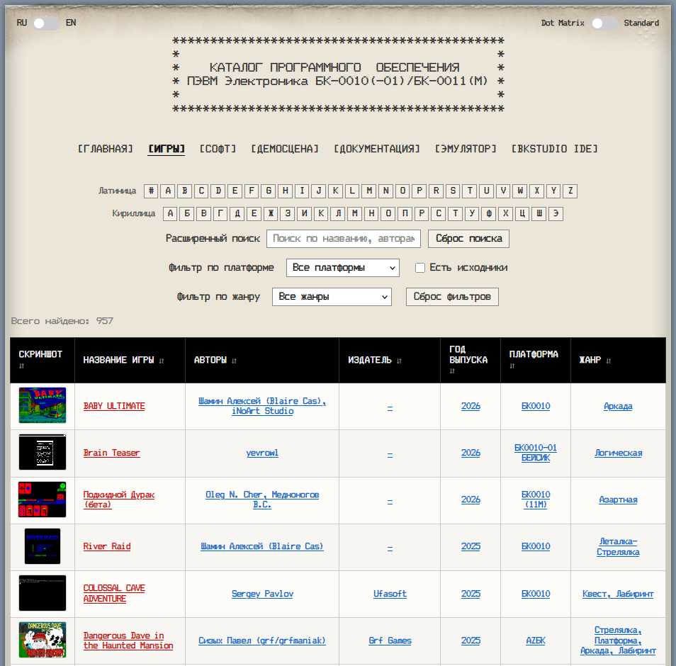
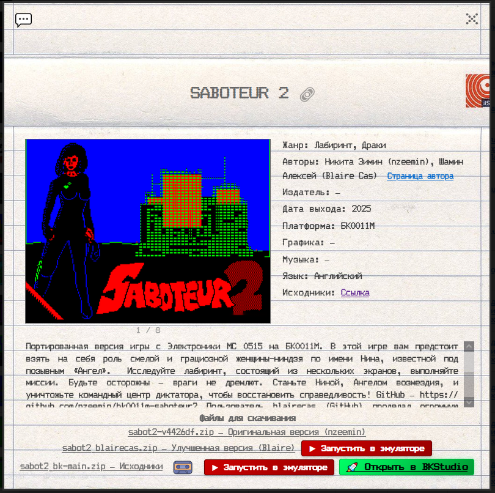
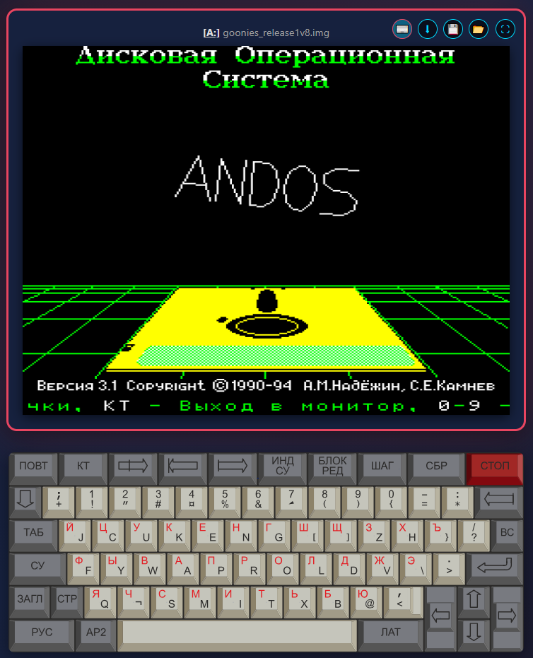
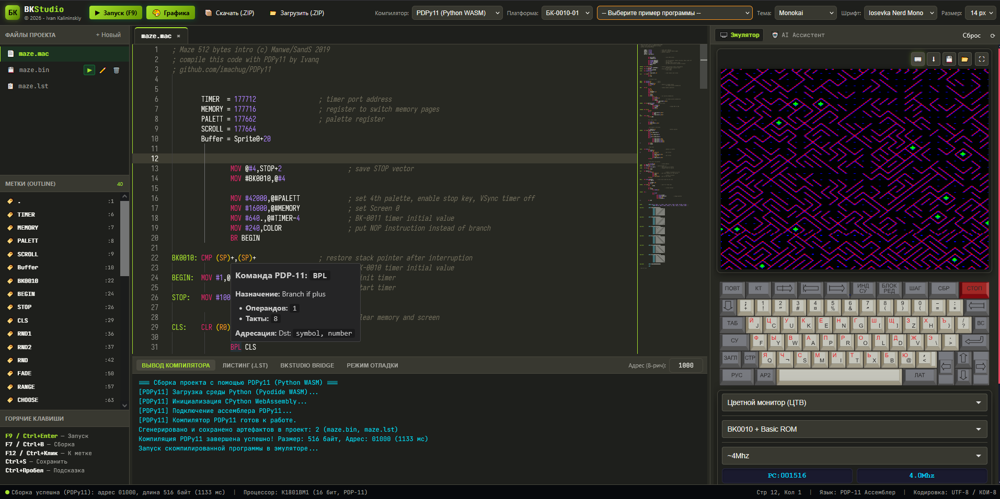

# 🗂️ Каталог программного обеспечения для Электроника БК-0010/БК-0011М

Интерактивный веб-каталог игр, прикладного ПО и демосцены для советских 16-битных компьютеров семейства **«Электроника БК-0010 / БК-0011М»** со встроенным **web-эмулятором БК** и полноценной средой разработки **BKStudio Web-IDE**.



Проект представляет собой 100% статический веб-сайт на HTML5, CSS и JavaScript — без внешних серверных зависимостей, фреймворков и сборщиков.

---

## 👀 Где посмотреть проект?

- **Каталог ПО и игр**: [GitHub Pages](https://kalininskiy.github.io/bk-catalog/) и [PDP-11.RU](https://bk.pdp-11.ru)
- **Web-эмулятор БК**: [GitHub Pages](https://kalininskiy.github.io/bk-catalog/emulator/bk-emulator.html) и [PDP-11.RU](https://bk.pdp-11.ru/emulator/bk-emulator.html)
- **Среда разработки BKStudio**: [GitHub Pages](https://kalininskiy.github.io/bk-catalog/bkstudio/) и [PDP-11.RU](https://bk.pdp-11.ru/bkstudio/)

---

## ✨ Ключевые возможности

### 🗂️ Каталог ПО, игр и демосцены
- ✅ **Три раздела каталога**: Игры, Программы (системное/прикладное ПО и утилиты) и Демосцена
- ✅ **Раздел документации**: встроенный просмотр ретро-статей и технической документации о БК в Markdown
- ✅ **Развитый поиск и фильтрация**:
  - Мгновенный поиск по названию с динамической подсветкой
  - Алфавитный указатель (кириллица, латиница, цифры)
  - Выпадающие списки фильтров: по платформе (БК-0010, БК-0010-01, БК-0011, БК-0011М), жанру, авторам, издателям, году, демопати и номинациям (компо)
  - Интерактивные чип-бейджи активных фильтров с возможностью быстрого сброса
  - Сортировка по столбцам таблиц



- ✅ **Детальные карточки программ**:
  - Полные метаданные (платформа, язык, звук, графика, разработчики, ссылки на исходный код)
  - Галерея скриншотов с полноразмерным просмотром и навигацией
  - Скачивание файлов и архивов программ
  - Кнопка **«▶ Запустить в эмуляторе»** для моментального открытия в web-эмуляторе БК
- ✅ **Встроенный ленточный конвертер BIN2WAV**: прямо в браузере преобразует бинарный файл в аудиосигнал формата WAV для воспроизведения на реальный магнитофонный вход настоящей БК
- ✅ **Двуязычный интерфейс (RU / EN)**: мгновенное переключение языка сайта с сохранением выбора
- ✅ **Ретро-стилизация**: CRT-эстетика, переключатель моноширинного шрифта (**Dot Matrix** / **Standard**), адаптивность под мобильные устройства и планшеты
- ✅ **SPA и Deep Linking**: hash-маршрутизация (`#games`, `#software`, `#demoscene`, `#docs`, `#home`) с прямыми ссылками на карточки

### 🖥️ Встроенный web-эмулятор БК ([emulator/](emulator/))



- ✅ Эмуляция процессора К1801ВМ1, тактового таймера и системы прерываний
- ✅ Конфигурации БК-0010-01 и БК-0011М (Бейсик, Фокал, МСТД, Монитор)
- ✅ Контроллер дисковода КНГМД (дискеты .BKD, .IMG до 800 Кб)
- ✅ Контроллер СМК-512: расширение ОЗУ до 512 Кб (ДОЗУ) + образы жестких дисков IDE/ATA (.HDS, .HDI)
- ✅ Звук: Speaker, Covox, музыкальный процессор AY-3-8910 и TurboSound (2xAY, 6 каналов) с регулятором громкости
- ✅ Видеосистема: режимы 512×256 и 256×256, 16 палитр БК-0011М, мультиколор, масштабирование Pixel Perfect, Fit 4:3, GPU Sharp-Bilinear WebGL-шейдер и CRT-фильтры
- ✅ Управление: физическая клавиатура с РУС/ЛАТ и АР2, векторная SVG-клавиатура БК-0011М, сенсорные мобильные кнопки (TouchControls), геймпады (Web Gamepad API) с аппаратным портом 177714 и диагоналями (28–31)
- ✅ Мгновенные сохранения (Save State v2) с GZIP-сжатием (`.json.gz`), кнопки 💾 / 📂 и drag-and-drop
- ✅ Встроенный отладчик (F11), дизассемблер PDP-11, точки останова и инструмент поиска жизней в играх (`Ctrl+L`)
- ✅ Программный API отладки (`window.emulatorDebug`), postMessage для BKStudio и WebSocket-клиент к мосту `bk-emulator-bridge` (порт 9091) для AI IDE / MCP

### 🛠️ Веб-среда разработки BKStudio ([bkstudio/](bkstudio/))



- ✅ Полнофункциональная Web-IDE для разработки на ассемблере PDP-11 прямо в браузере
- ✅ Профессиональный редактор Monaco Editor (движок VS Code) с ретро-темами и русским интерфейсом
- ✅ **Три встроенных Client-side WASM компилятора**:
  - **BKTurbo8 (C++ WASM)** — скоростной ассемблер Turbo8/MACRO-11
  - **PDPy11 (Python WASM / Pyodide)** — кросс-ассемблер с генерацией RAW, WAV и ROM
  - **DEC MACRO-11 + pclink11 (C/C++ WASM)** — эталонный макроассемблер DEC с компоновщиком, макробиблиотеками и `.map` файлами
- ✅ Автоопределение компилятора по исходному коду проекта
- ✅ Языковой сервер (LSP) для PDP-11: подсветка, автодополнение, hover-карточки инструкций и EMT, дерево меток (Outline), переход к определению (F12)
- ✅ Интерактивный аппаратный отладчик с визуализацией регистров К1801ВМ1, стека, системных портов и памяти
- ✅ Моментальный запуск и сборка одной кнопкой (F9) во встроенном окне эмулятора БК
- ✅ Графический редактор для БК, работа с экранами, с одиночными спрайтами и анимированными наборами (Sprite Sheets)
- ✅ AI-Ассистент с базой знаний, интерактивный справочник по архитектуре БК, а так же автономный разработчик с доступом ко всем внутренним инструментам BKStudio (умеет не только писать код, но и программно рисовать графику и спрайты)
- 
---

## 🚀 Быстрый старт

Проект представляет собой статический сайт и не требует компиляции или сборки.

Для запуска достаточно любого локального веб-сервера из корня репозитория:

- **Через Python**:
  ```bash
  cd bk-catalog
  python -m http.server 8000
  ```
  Затем откройте в браузере: `http://localhost:8000/index.html`

  После этого откройте в браузере `http://localhost:8000/index.html`.

---

## 📁 Структура проекта

```text
bk-catalog/
├── index.html                    # Главная страница каталога (SPA)
├── content/                      # База данных каталога (CSV и сгенерированные JSON)
│   ├── games.csv                 # Данные игр (источник истины)
│   ├── software.csv              # Данные программ и утилит
│   ├── demoscene.csv             # Данные демосцены
│   ├── bkpress.md                # Статьи и техническая документация о БК
│   ├── games.json                # Сгенерированные JSON-данные каталогов
│   ├── software.json
│   ├── demoscene.json
│   └── *-*.json                  # Справочники авторов, платформ, жанров, демопати
├── scripts/                      # Модули каталога (Vanilla JS / ES6 модули)
│   ├── main.js                   # Инициализация и обработчики
│   ├── games.js                  # Загрузка и рендеринг игр
│   ├── software.js               # Загрузка и рендеринг программ
│   ├── demoscene.js              # Загрузка и рендеринг демосцены
│   ├── rendering.js              # Отрисовка таблиц, карточек и диалогов
│   ├── filters.js                # Логика алфавита, выпадающих списков и фильтрации
│   ├── events.js                 # Делегирование событий интерфейса
│   ├── deeplink.js               # Hash-маршрутизация (#games, #software и т.д.)
│   ├── bin2wav-converter.js      # Клиентский конвертер BIN → WAV (аудиосигнал)
│   ├── images.js                 # Ленивая загрузка и предзагрузка скриншотов
│   ├── markdown.js               # Рендерер Markdown-документации
│   ├── utils.js                  # Парсинг CSV, нормализация строк, DOM-утилиты
│   └── i18n.js                   # Локализация (RU / EN)
├── styles/
│   └── stylesheet.css            # Все стили интерфейса (CRT ретро-тема)
├── emulator/                     # Web-эмулятор БК-0010/11М (HTML5/JS)
│   ├── bk-emulator.html          # Главная страница эмулятора
│   ├── src/                      # Ядро CPU, память, контроллеры, звук, отладчик
│   ├── DEBUG_RPC_API.md          # Спецификация программного отладочного JSON-RPC API
│   ├── SaveStateJson.md          # Спецификация формата сохранения состояния v2
│   └── README.md                 # Документация эмулятора
├── bkstudio/                     # Веб-среда разработки (Web-IDE) для ассемблера PDP-11
│   ├── index.html                # Главная страница IDE
│   ├── js/                       # Языковой сервер LSP, мосты компиляторов и эмулятора
│   ├── wasm/                     # WASM-модули BKTurbo8, MACRO-11, pclink11, Pyodide
│   └── README.md                 # Документация BKStudio
├── bk_games_files/               # Архивы с играми для БК
├── bk_files/                     # Архивы с прикладным и системным ПО
├── bk_games_screenshots/         # Скриншоты игр (полный размер)
├── bk_games_small_screenshots/   # Превью скриншотов игр (уменьшенные)
├── bk_screenshots/               # Скриншоты программ (полный размер)
├── bk_small_screenshots/         # Превью скриншотов программ (уменьшенные)
├── models/                       # Изображения и 3D-модели компьютеров БК
├── fonts/                        # Шрифты интерфейса (Dot Matrix и др.)
├── images/                       # Фоновые и декоративные элементы интерфейса
├── article_images/               # Иллюстрации к статьям документации
├── create_json_files.py          # Python: генерация JSON и справочников из CSV
├── resize_screenshots.py         # Python: пакетное уменьшение скриншотов
├── run_json_create.bat           # Скрипт перегенерации JSON
├── run_resize.bat                # Скрипт оптимизации скриншотов
├── LICENSE                       # Лицензия (GNU GPL v3)
└── README.md                     # Этот файл
```

---

## 🎯 Работа с каталогом

### 🔄 Поток данных и обновление записей

1. **CSV — источник данных**: все данные хранятся в `content/games.csv`, `content/software.csv` и `content/demoscene.csv`.
2. **Перегенерация JSON**: после правок в CSV запустите скрипт:
   ```bash
   python create_json_files.py
   # или запустите run_json_create.bat
   ```
   Скрипт автоматически создаст обновленные файлы каталогов и справочники уникальных значений для фильтров (авторы, жанры, платформы, демопати).
3. **Добавление скриншотов**: положите изображения в `bk_games_screenshots/` или `bk_screenshots/` и запустите создание уменьшенных превью:
   ```bash
   python resize_screenshots.py
   # или запустите run_resize.bat
   ```

### 📼 Онлайн-запуск и конвертация в ленту

- В карточке любой программы есть кнопка **«▶ Запустить в эмуляторе»**, открывающая интегрированный web-эмулятор, кроме того есть возможность открыть исходники (если они есть в наличии) в среде разработки BKStudio.
- В карточках, для загрузки магнитофонных программ на реальную БК, имеется встроенный конвертер из .BIN/.OVL в аудиоформат, который прямо в браузере сгенерирует аудиодорожку для подачи сигнала через аудиокабель в магнитофонный порт БК.

---

## 🤝 Вклад в проект

1. Форкните репозиторий.
2. Создайте тематическую ветку (`git checkout -b feature/new-game-entry`).
3. Внесите изменения (новые строки в CSV, скриншоты, файлы программ).
4. Запустите перегенерацию JSON (`python create_json_files.py`).
5. Закоммитьте изменения и отправьте Pull Request.

---

## 📄 Лицензия

Проект распространяется под свободной лицензией **GNU General Public License v3 (GPL-3.0-or-later)**. Полный текст лицензии находится в файле `LICENSE`.

## 📞 Контакты

(с) 2025-2026 by Ivan "VDM" Kalininskiy
- Telegram: [@VanDamM](https://t.me/VanDamM)
- GitHub: [kalininskiy](https://github.com/kalininskiy/)

Подробная документация компонентов:
- [Документация BK Emulator](emulator/README.md)
- [Спецификация API отладки эмулятора](emulator/DEBUG_RPC_API.md)
- [Документация среды разработки BKStudio](bkstudio/README.md)

