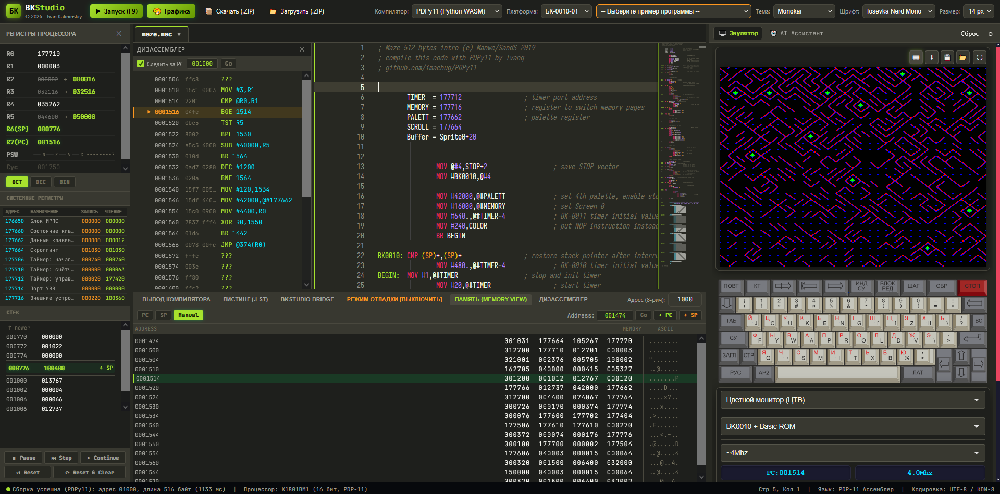
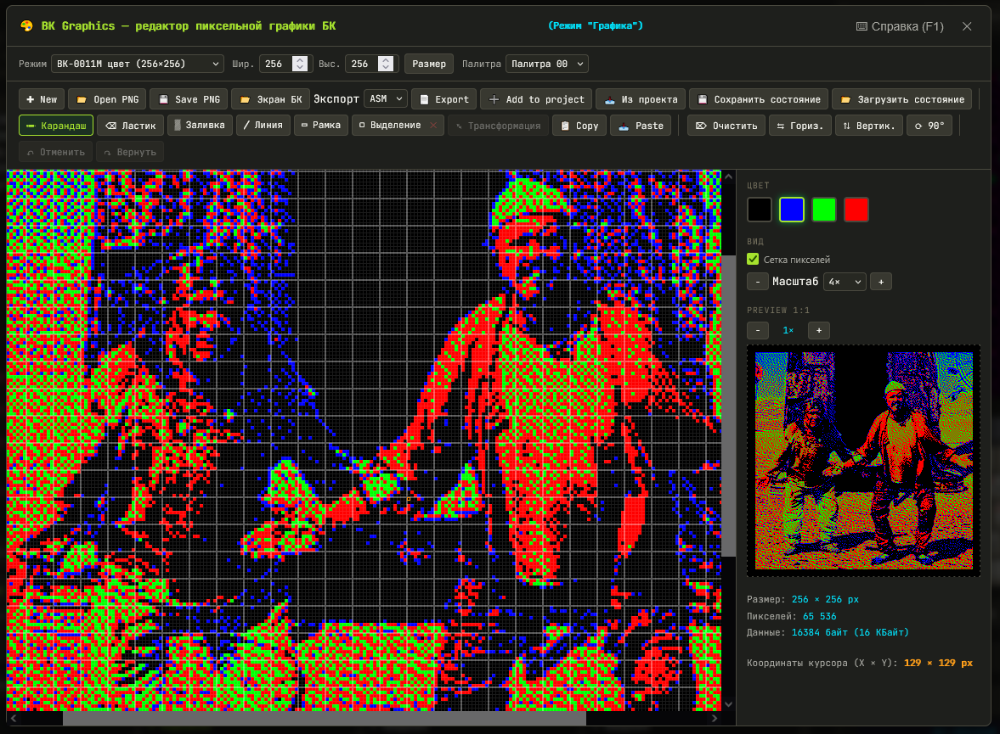
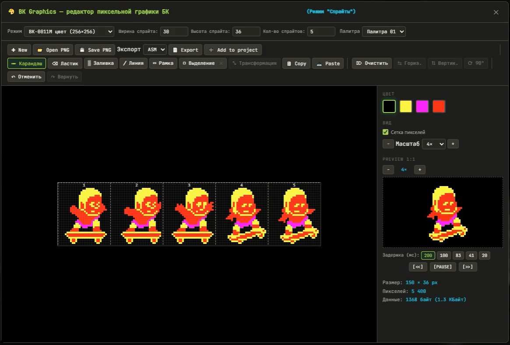
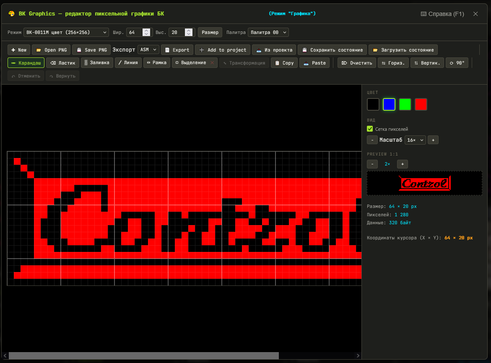
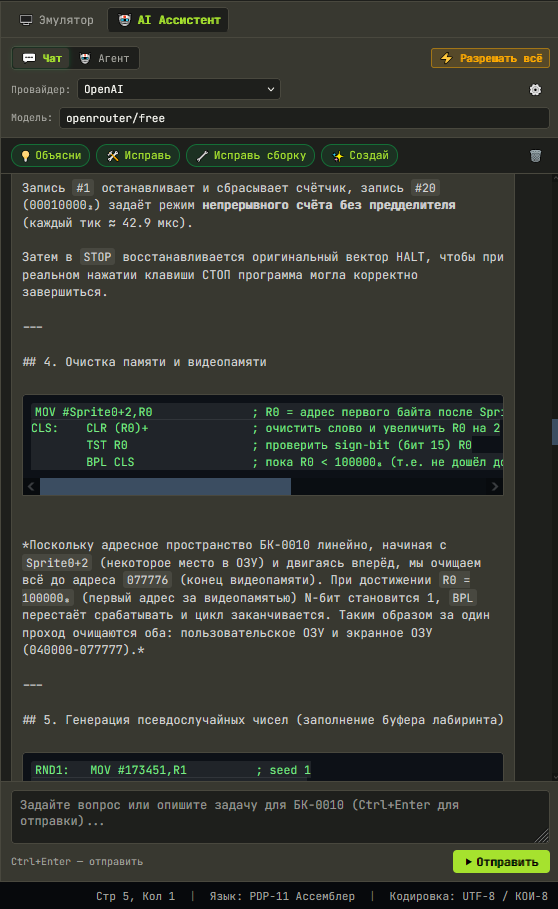
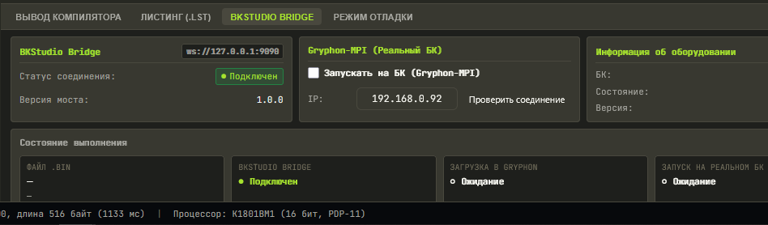

# 🛠️ BKStudio — веб-среда разработки (Web-IDE) для компьютеров семейства Электроника БК

BKStudio - Современная полнофункциональная веб-среда разработки (Web-IDE) на чистом JavaScript и WebAssembly для создания программ и игр на ассемблере PDP-11 для советских 16-битных компьютеров семейства **«Электроника БК»** (БК-0010, БК-0010-01, БК-0011, БК-0011М).

---


---

Включает профессиональный редактор кода (Monaco Editor), четыре встроенных кросс-компилятора (BKTurbo8 C++ WASM, PDPy11 Python WASM, macro11 Rhialto + pclink11 C/C++ WASM и современный GNU GCC 14.2.0 C WASM), языковой сервер (LSP), моментальный запуск в эмуляторе БК и 100% автономную работу без подключения к сети.

## 👀 Где посмотреть BKStudio?

Опробовать среду разработки онлайн:

- [GitHub Pages](https://kalininskiy.github.io/bk-catalog/bkstudio/)
- [PDP-11.RU](https://bk.pdp-11.ru/bkstudio/)

---

## 🚀 Быстрый старт

1. Откройте `bkstudio/index.html` в любом современном браузере (или запустите локальный сервер, например `python -m http.server 8000`).
2. Выберите демонстрационную программу из выпадающего списка **«-- Примеры программ --»** или начните писать свой код.
3. Нажмите кнопку **«Запуск (F9)»** (или `Ctrl+Enter`) — проект автоматически скомпилируется, и бинарный файл мгновенно запустится во встроенном эмуляторе БК.

---

## 📁 Структура проекта

```
bkstudio/
├── index.html                  # Главная страница IDE (среда разработки)
├── README.md                   # Документация BKStudio (этот файл)
├── css/
│   └── bkstudio.css            # Стили интерфейса, сплиттеров, панелей и CRT-тем
├── js/
│   ├── app.js                  # Главный контроллер приложения, UI и координация
│   ├── compiler-bridge.js      # Единый мост переключения компиляторов (BKTurbo8 / PDPy11 / MACRO-11)
│   ├── compiler-service.js     # Сервис запуска и парсинга вывода BKTurbo8.wasm
│   ├── pdpy11-worker.js        # Web Worker для компиляции PDPy11 в Pyodide CPython WASM
│   ├── emulator-bridge.js      # Мост взаимодействия с iframe эмулятора БК (postMessage)
│   ├── project-manager.js      # Менеджер файлов проекта, вкладок и LocalStorage
│   ├── samples.js              # Каталог встроенных обучающих примеров программ
│   └── lsp/
│       ├── pdp11-lsp.js        # Языковой сервер PDP-11 (диагностика, символы, парсер)
│       └── pdp11-monaco.js     # Провайдер языка для Monaco (подсветка, hover, автодополнение)
├── wasm/
│   ├── BKTurbo8.js             # Emscripten-рантайм для BKTurbo8
│   ├── BKTurbo8.wasm           # Бинарный модуль кросс-ассемблера BKTurbo8 (C++ WASM)
│   ├── macro11.js              # Emscripten-рантайм для классического MACRO-11
│   ├── macro11.wasm            # Бинарный модуль MACRO-11 (C99 WASM)
│   ├── pclink11.js             # Emscripten-рантайм для компоновщика pclink11
│   ├── pclink11.wasm           # Бинарный модуль компоновщика pclink11 (C++11 WASM)
│   └── pdpy11.zip              # Пакет исходников компилятора PDPy11 для Pyodide
├── libs/
│   ├── jszip.min.js            # Упаковка и распаковка ZIP-архивов проектов
│   ├── monaco/                 # Локальный дистрибутив редактора Monaco 0.52.2
│   │   └── vs/                 # Ядро редактора, стили, воркеры и локализация NLS
│   └── pyodide/                # Локальный CPython 3.12 WebAssembly (Pyodide v0.26.4)
│       ├── pyodide.js          # Загрузчик среды Python
│       ├── pyodide.asm.js      # Связующий JS-код
│       ├── pyodide.asm.wasm    # Ядро WASM интерпретатора Python
│       └── python_stdlib.zip   # Стандартная библиотека Python
└── fonts/                      # Локальные моноширинные шрифты (Iosevka, JetBrains, Fira Code)
```

---

## ✨ Возможности

- ✅ **Редактор Monaco Editor (движок VS Code):**
  - Локальная русская локализация сообщений интерфейса редактора.
  - Поддержка вкладок файлов, сворачивания блоков, номеров строк, мини-карты и множественных курсоров.
  - Стилизованные ретро-темы: *CRT Зелёный*, *CRT Янтарный*, *VS Dark*, *Monokai*, *Светлая*.
  - Выбор моноширинных шрифтов: *Iosevka Nerd Mono*, *JetBrains Mono*, *Fira Code*, *Cascadia Code*, *Consolas*, *Courier New*.
- ✅ **Три встроенных компилятора (Client-side WASM, без серверной части):**
  - **BKTurbo8 (C++ WASM)** — молниеносная скорость компиляции классического синтаксиса MACRO-11 и расширений Turbo8.
  - **PDPy11 (Python WASM через Pyodide)** — кросс-ассемблер с богатыми возможностями: генерация дампов памяти (`make_raw`), "аудиокассет" (`make_wav`, `make_turbo_wav`), ROM-образов (`make_bk0010_rom`), поддержка блоков повторений `.repeat` в фигурных скобках `{ ... }` и межмодульного связывания `.extern all`.
  - **MACRO-11 + pclink11 (C/C++ WASM)** — эталонный макроассемблер DEC PDP-11 (порт Richard Krehbiel / Rhialto) в связке с компоновщиком `pclink11` (Никита Зимин). Поддерживает полный аутентичный синтаксис, разделы памяти `.ASECT`/`.PSECT`, макробиблиотеки `.MCALL`, макросы `.MACRO`, `.IRP`, `.IRPC`, условную компиляцию и генерацию карты компоновки (`.map`).
- ✅ **Интеллектуальное автоопределение компилятора:**
  - При открытии любого проекта или распаковке ZIP-архива IDE анализирует код и автоматически выбирает нужный транслятор (PDPy11, MACRO-11 или BKTurbo8).
- ✅ **Языковой сервер (LSP) для ассемблера PDP-11:**
  - Подсветка инструкций процессора К1801ВМ1, системных вызовов `EMT`, директив, чисел (восьмеричных, десятичных, шестнадцатеричных) и меток.
  - Всплывающие карточки **Hover** с назначением инструкций, тактами, флагами, кодами операций и деталями системных вызовов `EMT 0..EMT 44`.
  - Автодополнение команд, директив, регистров и меток (IntelliSense).
  - Дерево символов и меток (**Outline**) на боковой панели с мгновенным переходом к строке кода.
  - Переход к определению (Go to definition) (`F12` / `Ctrl+Клик`).
  - Статический анализ и показ ошибок компиляции в коде в реальном времени.
- ✅ **Интегрированный эмулятор БК:**
  - Правая панель с полнофункциональным веб-эмулятором БК-0010-01 и БК-0011М.
  - Автоматическая передача платформы и типа загрузки.
- ✅ **Полнофункциональный режим отладки (Interactive Hardware Debugger):**
  - Кнопка **«Режим отладки»** в нижней панели трансформирует интерфейс IDE в полноценную отладочную среду разработчика.



-
	- **Регистры процессора и состояния (К1801ВМ1):**
	  - Регистры общего назначения R0–R5, указатель стека SP (R6) и счётчик команд PC (R7).
	  - Индикация изменений: подсветка изменившихся значений со стрелкой перехода (`old → new`).
	  - Регистр состояния процессора **PSW** с детальной расшифровкой флагов `N` (отрицательный), `Z` (ноль), `V` (переполнение), `C` (перенос).
	  - Переключение систем счисления значений регистров на лету: **OCT** (восьмеричная), **DEC** (десятичная), **BIN** (двоичная).
	  - Системные регистры БК (176650..177716: клавиатура, таймер, системный порт, регистр палитры).
	- **Инспектор стека:** отображение фрейма стека вокруг указателя SP с маркерами глубин `↑ newer` / `↓ older`.
	- **Панель управления исполнением процессора:**
	  - `⏸ Pause` — немедленная приостановка работы процессора.
	  - `⏭ Step` — пошаговое выполнение одной машинной инструкции К1801ВМ1.
	  - `▶ Continue` — продолжение непрерывного исполнения.
	  - `↺ Reset` и `⟳ Reset & Clear` — мягкий и полный аппаратный сброс процессора и ОЗУ.
	- **Интерактивные точки останова (Breakpoints):**
	  - Установка и снятие точек останова в один клик по левому полю (Glyph Margin)
	  - Подсветка текущей выполняемой строки кода (PC) с автоматическим скроллингом редактора к активной инструкции.
	- **Интегрированный дизассемблер PDP-11:**
	  - Доступен как в нижней вкладке, так и в виде **боковой панели дизассемблера**, располагающейся рядом с кодом.
	  - Режим слежения за счётчиком команд («Следить за PC») или ручной ввод любого 8-ричного адреса памяти.
	  - Отображение адреса, шестнадцатеричных/восьмеричных опкодов и символьных мнемоник инструкций.
	- **Инспектор оперативной памяти (Memory View):**
	  - Полноценный шестнадцатеричный/восьмеричный дамп памяти с ASCII-колонкой в нижней панели.
	  - Режимы слежения: `PC` (следить за кодом), `SP` (следить за вершиной стека), `Manual` (произвольный просмотр).
	  - Быстрый переход по любому 8-ричному адресу или кнопками `→ PC`, `→ SP`.
- ✅ **Запуск любых .BIN прямо из списка файлов проекта:**
  - Кнопка **`▶`** рядом с каждым бинарным файлом позволяет запустить любой собранный бинарник в один клик.
- ✅ **Сохранение и экспорт всех артефактов:**
  - Все выходные файлы компиляции (`.bin`, `.obj`, `.lst`, `.map`, `.raw`, `.wav`) сохраняются в проекте, отображаются в дереве файлов и включаются в скачиваемый `.ZIP`.
- ✅ **Импорт и экспорт проектов:**
  - Кнопка **«Загрузить (.ZIP)»** — открытие любого существующего архива с исходниками.
  - Кнопка **«Скачать (.ZIP)»** — сохранение текущего проекта со всеми исходными текстами и собранными бинарниками.
  - Поддержка открытия архивов с исходниками из карточек каталога.
- ✅ **Встроенный графический редактор экранов и спрайтов БК (BK Graphics Editor):**



-
	- Кнопка **«🎨 Графика»** открывает профессиональный пиксельный редактор прямо в IDE.
	- Поддержка оригинальных графических режимов БК: цветной 4-цветный 256×256 (палитры БК-0010/11М), чёрно-белый 512×256.



-
	- Полноценная работа с **одиночными спрайтами и анимированными наборами (Sprite Sheets)**:
	  - Настройка геометрии кадра (ширина, высота, количество кадров анимации).
	  - Встроенный интерактивный плеер анимации спрайтов с настройкой частоты кадров (FPS).
	  - Импорт внешних изображений и Sprite Sheets из PNG с интерактивным диалогом нарезки на кадры.
	- Инструменты рисования: карандаш, ластик, заливка, прямые линии, прямоугольники, пиксельное выделение, свободная трансформация (масштабирование и поворот), отражение по осям, многоуровневая история Undo/Redo (до 60 шагов).



-
	- Экспорт во все форматы для разработки:
	  - Ассемблерные исходники `.MAC`/`.ASM` с готовыми метками для прямой вставки в код.
	  - Бинарные файлы образа экрана `.BIN` (16388 байт, адрес 040000) и сырые дампы памяти `.DAT`.
	  - Образы экранов БК-0011М `.BKS` (16389 байт с байтом палитры).
	  - Растровые файлы `.PNG` и сохранение сессий с состоянием редактора в `.BKGfxState` прямо в папку проекта `gfx/`.
- ✅ **Интегрированный AI-Ассистент и Агент (BKStudio AI):**
  - Вкладка **«🤖 AI Ассистент»** в правой панели с поддержкой любых моделей через OpenAI-совместимый API (в том числе и локальные llama.cpp / Ollama / LM Studio).

	

-
	- Два режима работы:
  		- **💬 Чат** — мгновенный интерактивный справочник по архитектуре процессора К1801ВМ1, регистрам БК-0010/БК-0011М, системным вызовам `EMT` и тонкостям ассемблера PDP-11.
  		- **🤖 Агент** — автономный интеллектуальный разработчик с вызовом внутренних инструментов BKStudio.
	- **Автономное программирование и TDD:**
  	- Кнопка **«🔧 Исправь сборку»**: агент самостоятельно запускает компиляцию, считывает диагностику ошибок, находит сбойные строки, редактирует файлы проекта и добивается успешной сборки.
  	- Автогенерация подпрограмм, оптимизация машинного кода по тактам и памяти, подробное комментирование сложных алгоритмов.
	- **Генерация и редактирование графики AI-ассистентом:**
  		- AI умеет не только писать код, но и программно рисовать графику и спрайты через безопасный `BKGraphics AI API`.
  		- Генерация игровых персонажей, тайлов, шрифтов, анимационных циклов (ходьба, прыжок, атака), размещение их в sprite sheets и автоматическое добавление сгенерированных спрайтов в проект.
- ✅ **Интеграция с реальным БК через Gryphon-MPI:**
  - Прямой запуск скомпилированных `.BIN` на реальном компьютере Электроника БК (БК-0010/БК-0011М) напрямую из браузера через аппаратный HTTP REST API адаптера Gryphon-MPI (без необходимости запуска каких-либо промежуточных серверов или мостов).



-
	- Строго последовательный конвейер загрузки и запуска (`POST /api/upload` с сохранением в `/BK_Uploads/*.BIN` $\rightarrow$ `GET /api/run?dev=file&emu10=no&fname=...`).
	- Прямая работа из браузера через `Fetch API`, `FormData` и `AbortController` с контролем таймаутов и понятной диагностикой CORS / Mixed Content.
	- Панель управления и мониторинга в нижней вкладке **«BKStudio Bridge»**: статус оборудования БК (`/api/bkinfo`, `/api/version`, `/api/status`), кнопка проверки связи, пошаговый мониторинг выполнения и журнал операций с временными метками.
	- Сохранение настроек в `LocalStorage` и поддержка быстрой авто-активации по URL-параметру `?GMPI=<IP-адрес>`.
- ✅ **Двусторонний BKStudio Bridge & MCP-сервер для внешних AI-сред:**
	- Встроенный WebSocket-клиент JSON-RPC 2.0 (`ws://127.0.0.1:9090`) для связи с внешним процессом BKStudio Bridge (используется исключительно для подключения внешних AI IDE/агентов по протоколу MCP, а не для работы с Gryphon-MPI).
	- Поддержка более 52 инструментов (`bkAITools` / MCP): управление файлами проекта, сборка, интерактивная пошаговая отладка в эмуляторе, чтение/запись регистров и памяти, полный контроль над графическим редактором и прямое управление сетевым адаптером Gryphon-MPI (`gryphon.check`, `gryphon.upload`, `gryphon.run`, `gryphon.deploy`).
- ✅ **100% автономность (Zero CDN):**
	- Все библиотеки, шрифты и рантаймы хранятся локально — IDE полностью работоспособна без подключения к интернету.

---

## ⚙️ Сравнение компиляторов

| Параметр               | BKTurbo8 (C++ WASM)                                                   | PDPy11 (Python WASM)                                                                     | MACRO-11 + pclink11 (C/C++ WASM)                                                       |
| ---------------------- | --------------------------------------------------------------------- | ---------------------------------------------------------------------------------------- | -------------------------------------------------------------------------------------- |
| **Движок**             | Скомпилирован в WebAssembly из C++                                    | CPython 3.12 в WebAssembly (Pyodide)                                                     | macro11 (C99 WASM) + pclink11 (C++11 WASM)                                             |
| **Скорость сборки**    | Очень высокая; нативный C++/WASM                                      | Обычно высокая для небольших исходников, но есть накладные расходы Python/WASM           | Очень высокая; C/C++/WASM, но сборка состоит из ассемблирования + линковки             |
| **Синтаксис**          | PDP-11 / Turbo8 + расширения BKTurbo8 (.script, .ends, @include, %0=) | Классический PDP-11 + расширения PDPy11 (.repeat, .extern, .dword, .charset)             | macro11 (Rhialto)                                                                      |
| **Команды сборки**     | Параметры командной строки (`-o`, `-l`, `CO`, `CL`, `LI`)             | Метакоманды в коде (`make_bin`, `make_raw`, `make_wav`, `make_turbo_wav`, `insert_file`) | Двухстадийный пайплайн: ассемблирование в `.obj` + компоновка в `.bin` с картой `.map` |
| **Блоки кода**         | `.SCRIPT/.ENDS`                                                       | `.REPEAT <N> { ... }`                                                                    | `.REPT`, `.IRP`, `.IRPC`, условные `.IF`/`.ENDC`                                       |
| **Особенность для БК** | Нативно ориентирован на БК и содержит БК-специфические возможности    | Удобен для простых самостоятельных БК-программ и проектов                                | Наиболее близок к историческому MACRO-11; pclink11 дополнительно адаптирован для БК    |

---

## 🎮 Поддерживаемые форматы файлов и артефактов

| Формат               | Тип      | Назначение                                                                                               |
| -------------------- | -------- | -------------------------------------------------------------------------------------------------------- |
| **.MAC / .ASM / .S** | Текст    | Исходные тексты программ на ассемблере PDP-11                                                            |
| **.INC**             | Текст    | Включаемые файлы определений, макросов и констант                                                        |
| **.BIN**             | Двоичный | Исполняемый файл для БК (с 4-байтным заголовком адреса и длины). Запускается в эмуляторе кнопкой **`▶`** |
| **.OBJ**             | Двоичный | Объектный модуль RT-11/RSX-11, сформированный ассемблером MACRO-11                                       |
| **.LST**             | Текст    | Листинг ассемблирования с адресами, кодами операций и исходным текстом                                   |
| **.MAP**             | Текст    | Карта распределения памяти и таблицы символов компоновщика pclink11                                      |
| **.RAW**             | Двоичный | Сырой образ памяти без системного заголовка                                                              |
| **.WAV**             | Аудио    | Аудиозапись программы в формате магнитофонной ленты БК                                                   |
| **.ZIP**             | Архив    | Полный архив проекта со всеми исходными текстами и собранными артефактами                                |

---

## ⌨️ Горячие клавиши

| Сочетание клавиш            | Действие                                        |
| --------------------------- | ----------------------------------------------- |
| **F9** или **Ctrl + Enter** | **Собрать проект и запустить** в эмуляторе БК   |
| **F7** или **Ctrl + B**     | Собрать проект без автоматического запуска      |
| **F12** или **Ctrl + Клик** | Перейти к определению метки в коде              |
| **Ctrl + S**                | Сохранить проект в локальное хранилище браузера |
| **Ctrl + Пробел**           | Вызвать автодополнение кода (IntelliSense)      |

---

## 🎯 Использование

### 1. Работа с исходным кодом

- Редактируйте исходные тексты в центральной панели Monaco Editor.
- При наведении курсора на инструкцию, директиву или системный вызов `EMT` открывается подробная справочная карточка.
- Ошибки трансляции подчёркиваются красным цветом с указанием точной строки и причины.

### 2. Многофайловые проекты

- Добавляйте новые файлы модулей через кнопку **«+ Новый»** в левой панели.
- Для переключения между файлами используйте вкладки над редактором или дерево файлов.
- Для включения файлов используйте директиву `.INCLUDE "sub.mac"` (или `@INCLUDE` в BKTurbo8).

### 3. Управление артефактами и запуск

- После сборки проекта все сгенерированные файлы (`.bin`, `.obj`, `.lst`, `.map`, `.raw`, `.wav`) автоматически появляются в списке файлов проекта слева.
- Нажмите зелёную кнопку **`▶`** рядом с любым `.bin`-файлом, чтобы немедленно запустить его в окне виртуальной БК.
- Нажатие на файл `.lst` или `.map` открывает полный листинг и карту распределения памяти для анализа работы компилятора и компоновщика.

### 4. Экспорт и импорт проектов

- Нажмите **«Скачать (.ZIP)»** — сформируется архив с исходниками и всеми скомпилированными файлами.
- Нажмите **«Загрузить (.ZIP)»** — распакуется архив с вашего диска с автоопределением компилятора и главного файла.

### 5. Запуск на реальном компьютере БК (Gryphon-MPI)

BKStudio взаимодействует с сетевым контроллером **Gryphon-MPI напрямую из браузера по HTTP REST API** (`http://<IP>/api`). Внешний сервер `bkstudio-bridge` для работы с Gryphon **не требуется** и в сетевом обмене не участвует.

- **Настройка подключения:**
  - Перейдите во вкладку **«BKStudio Bridge»** в нижней панели (блок «Gryphon-MPI (Запуск на реальном БК)»).
  - Включите опцию **«☑ Запускать на БК (Gryphon-MPI)»** и укажите IP-адрес сетевого адаптера БК (по умолчанию `192.168.0.92`).
  - Нажмите **«Проверить соединение»** для отправки прямого диагностического запроса `/api/version` и `/api/bkinfo` к контроллеру.
- **Сценарий сборки и запуска (F9):**
  - При нажатии **«Запуск (F9)»** IDE компилирует проект в `.BIN`.
  - Модуль `BKStudioGryphonClient` отправляет бинарник напрямую в контроллер: `POST http://<IP>/api/upload` (в каталог `/BK_Uploads/<ФАЙЛ>.BIN` как multipart/form-data).
  - Сразу после успешной загрузки отправляется команда на запуск: `GET http://<IP>/api/run?dev=file&emu10=no&fname=/BK_Uploads/<ФАЙЛ>.BIN`.
  - Программа немедленно стартует на физическом компьютере БК.
- **Быстрый запуск по ссылке (`?GMPI=<IP>`):**
  - Поддерживается автоматическая установка IP и активация режима через параметр URL:
    `http://localhost:8000/bkstudio/index.html?GMPI=192.168.0.92`
- **Браузерные ограничения (CORS и Mixed Content):**
  - **CORS:** Gryphon-MPI должен разрешать кросс-доменные запросы от браузера (заголовок `Access-Control-Allow-Origin: *`). Если CORS запрещён или заблокирован, IDE выведет соответствующее диагностическое предупреждение.
  - **Mixed Content:** Если BKStudio открыта по защищённому протоколу **HTTPS** (например, на GitHub Pages), современные браузеры блокируют обращение к локальным незащищённым адресам `http://192.168.x.x` как небезопасный Mixed Content. Для работы с реальным контроллером открывайте BKStudio по протоколу **HTTP** (например, через локальный веб-сервер `http://localhost:8000/bkstudio/` или `http://127.0.0.1:8000/`).
- **Роль BKStudio Bridge:**
  - `bkstudio-bridge` (`ws://127.0.0.1:9090`) предназначен исключительно для взаимодействия внешних AI-сред (Claude Desktop, Cursor, Antigravity IDE) со студией по протоколу **MCP**.
  - При вызове инструментов `gryphon.deploy`, `gryphon.upload`, `gryphon.run`, `gryphon.check` из внешнего MCP или встроенного AI-агента запрос транслируется в единый браузерный клиент `BKStudioGryphonClient`, без каких-либо прокси-серверов.

### 6. Создание графики и анимированных спрайтов (BK Graphics Editor)

- Нажмите кнопку **«🎨 Графика»** в верхней панели инструментов.
- Выберите режим экрана (цветной 256×256 или ч/б 512×256), настройте геометрию спрайтов (например, 16×16) и число кадров анимации для создания **Sprite Sheet**.
- Рисуйте пиксельную графику инструментами холста или импортируйте готовый PNG-файл с автоматической нарезкой на кадры.
- Во встроенном плеере анимации проверьте движение спрайта на выбранной частоте кадров.
- Нажмите **«В проект»** или **«Экспорт .ASM»** — редактор сгенерирует код с метками кадров и автоматически добавит их в проект.

### 7. Использование встроенного AI-Ассистента

- Переключите правую панель на вкладку **«🤖 AI Ассистент»**.
- Нажмите иконку ⚙️ и настройте подключение (Base URL и API Key любого OpenAI-совместимого провайдера или локальной LLM).
- **В режиме «💬 Чат»**: задавайте вопросы по кодам операций К1801ВМ1, алгоритмам и вызовам EMT (например: *"Как вывести строку через EMT 16 на БК-0010?"*).
- **В режиме «🤖 Агент»**:
  - Нажмите **«🔧 Исправь сборку»** для автоматического исправления ошибок компиляции в проекте.
  - Попросите нарисовать графику (например: *"Создай анимированный спрайт бегущего рыцаря 16×16 из 4 кадров и сохрани в gfx/knight.mac"*). Агент самостоятельно нарисует пиксели, упакует их в sprite sheet и добавит готовый файл в дерево проекта.

### 8. Интерактивная аппаратная отладка программ

- В нижней панели нажмите вкладку **«Режим отладки»**:
  - Боковая панель переключается с дерева файлов на **панель регистров** (R0–R5, SP, PC, флаги PSW, системные регистры) и **стек**.
  - В редакторе активируется дизассемблер и полоса отладочных маркеров (Glyph Margin).
- **Точки останова (Breakpoints):** кликните на левое поле в строке дизассемблера — установится красная точка останова.
- **Управление шагами:** используйте кнопку **`⏭ Step`** для выполнения ровно одной инструкции, **`⏸ Pause`** для заморозки и **`▶ Continue`** для продолжения работы.
- **Дизассемблер:** переключитесь на вкладку «Дизассемблер» внизу или откройте боковой дизассемблер рядом с кодом редактора с флагом «Следить за PC». Клик по инструкции в дизассемблере подсветит соответствующую строку в исходном файле `.MAC`.
- **Дамп памяти (Memory View):** выберите вкладку «Память (Memory View)» для наблюдения за ОЗУ БК в реальном времени с авто-синхронизацией по PC или SP.

---

## 🤝 Благодарности

- **gid** — автор кросс-ассемблера ([BKTurbo8](https://gid.pdp-11.net/bkturbo8_doc.html)).
- **Команда PDPy11** ([github.com/pdpy11/pdpy11](https://github.com/pdpy11/pdpy11)) — мощный модульный кросс-ассемблер на Python.
- **Richard Krehbiel** и **Olaf 'Rhialto' Seibert** — авторы переносимого компилятора [MACRO-11](https://gitlab.com/Rhialto/macro11/).
- **Никита Зимин (nzeemin)** — автор компоновщика [pclink11](https://github.com/nzeemin/pclink11) для связывания OBJ-модулей.
- Проект редактора кода [Monaco Editor](https://microsoft.github.io/monaco-editor/).
- **Команда Pyodide** ([pyodide.org](https://pyodide.org/)) — компиляция CPython в WebAssembly.

---

## 📄 Лицензия

GNU General Public License Version 3 (GPLv3).  
Полный текст лицензии находится в корневом файле `LICENSE`.

---

## 📞 Контакты

(c) 2025–2026 Иван "VDM" Калининский

- Telegram: [@VanDamM](https://t.me/VanDamM)
- GitHub: [kalininskiy](https://github.com/kalininskiy/)
