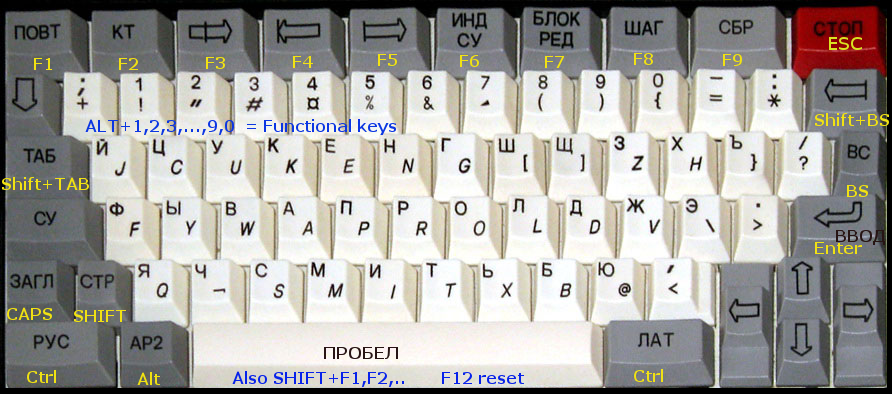

# 🖥️ Эмулятор БК-0010/БК-0011М

Эмулятор советского 16-битного компьютера семейства Электроника БК, написанный на HTML5 + JavaScript.

## 👀 Где посмотреть эмулятор?

Посмотреть эмулятор в действии: [GitHub Pages](https://kalininskiy.github.io/bk-catalog/emulator/bk-emulator.html) и [PDP-11.RU](https://bk.pdp-11.ru/emulator/bk-emulator.html).

## 🚀 Быстрый старт

1. Откройте `bk-emulator.html` в браузере
2. Выберите игру из списка или перетащите файл на экран

## 📁 Структура проекта

```
emulator/
├── bk-emulator.html           # Главная страница эмулятора
├── content/                   # Ресурсы
├── files/                     # Игры и программы
├── src/                       # Исходный код эмулятора
│   ├── core/                  # Ядро: CPU, память, дизассемблер
│   ├── peripherals/           # Периферия: ввод, звук, контроллеры
│   ├── system/                # Система: ROM'ы, базовый класс БК
│   ├── ui/                    # Интерфейс: отладчик, читы
│   ├── utils/                 # Утилиты: работа с файлами
│   └── app.js                 # Главное приложение
├── README.md                  # Этот файл
```

## ✨ Возможности

- ✅ Эмуляция процессора К1801ВМ1
- ✅ Поддержка БК-0010-01 и БК-0011М
- ✅ Звук: Speaker, Covox, AY-3-8910
- ✅ Дисковод (FDD)
- ✅ Отладчик с дизассемблером
- ✅ Загрузка файлов: BIN, COD, BKD, IMG, ROM, ZIP
- ✅ Система читов для игр

## 🎮 Поддерживаемые форматы файлов

| Формат | Описание                |
|--------|-------------------------|
| .BIN   | Бинарные файлы программ |
| .COD   | Программы на BASIC      |
| .BKD   | Образы дисков БК        |
| .IMG   | Образы дискет           |
| .ROM   | ROM-файлы               |
| .ZIP   | Архивы с файлами        |

## 🎯 Использование

### Загрузка своего файла
1. Перетащите файл мышкой на экран эмулятора
2. Или используйте стандартный диалог открытия файла

### Управление
- **Клавиатура** - используйте клавиатуру компьютера

- **F11** - открыть отладчик
- **F12** - перезагрузка (Reset)

### Отладка
1. Нажмите F11 или выберите "Debug (F11)" в меню
2. Откроется окно отладчика с дизассемблером
3. Просматривайте код, регистры, память

## 🐛 Известные проблемы

- Качество звука Covox и AY8910 оставляет желать лучшего
- Некоторые программы могут работать некорректно

## 🤝 Благодарности

- Исходный эмулятор version 1.h (07.2021): https://chessforeva.neocities.org/BK/bk (Портированный с Java BK2010 на JavaScript)

## 📄 Лицензия

GNU GENERAL PUBLIC LICENSE Version 3

## 📞 Контакты

(с) 2025-2026 by Ivan "VDM" Kalininskiy
- Telegram: [@VanDamM](https://t.me/VanDamM)

---
