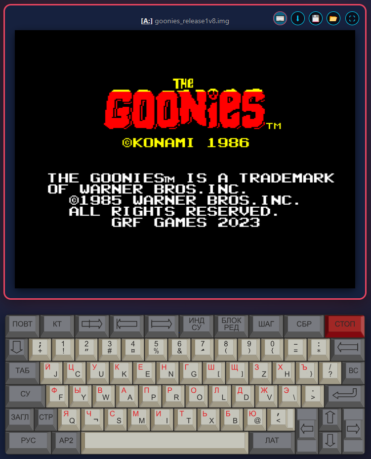

# 🖥️ Эмулятор БК-0010/БК-0011М

Эмулятор советского 16-битного компьютера семейства Электроника БК, написанный на HTML5 + JavaScript.



## 👀 Где посмотреть эмулятор?

Посмотреть эмулятор в действии: [GitHub Pages](https://kalininskiy.github.io/bk-catalog/emulator/bk-emulator.html) и [PDP-11.RU](https://bk.pdp-11.ru/emulator/bk-emulator.html).

## 🚀 Быстрый старт

1. Откройте эмулятор в браузере
2. Перетащите файл на область экрана

## 📁 Структура проекта

```
emulator/
├── bk-emulator.html           # Главная страница эмулятора
├── content/                   # Ресурсы
├── files/                     # Игры и программы
├── src/                       # Исходный код эмулятора
│   ├── core/                  # Ядро: CPU, память, дизассемблер
│   ├── peripherals/           # Периферия: ввод, звук, контроллеры
│   ├── system/                # Система: ROM'ы, базовый класс БК
│   ├── ui/                    # Интерфейс: отладчик, читы
│   ├── utils/                 # Утилиты: работа с файлами
│   └── app.js                 # Главное приложение
├── README.md                  # Этот файл
```

## ✨ Возможности

### Аппаратная часть и платформа
- ✅ **Процессор**: эмуляция процессора К1801ВМ1, системного таймера
- ✅ **Платформы БК**: БК-0010, БК-0010-01, БК-0011, БК-0011М
- ✅ **Память и расширения**:
  - Базовая память БК-0010 (32 Кб) и БК-0011М (128 Кб со страницами)
  - Расширение памяти до 512 Кб — контроллер ДОЗУ СМК-512
- ✅ **Дисковые накопители**:
  - Контроллер КНГМД (К1801ВП1-128, образы дискет до 800 Кб)
  - Жесткие диски IDE/ATA (образы .HDS, .HDI) через контроллер СМК-512
- ✅ **Звуковая подсистема**:
  - Встроенный Speaker, Covox
  - Музыкальный сопроцессор AY-3-8910
  - TurboSound (2x AY-3-8910 — 6 каналов звука)
  - Регулировка громкости и сохранение звуковых настроек

### Графика и видеосистема
- ✅ **Видеорежимы**: 512×256 (монохромный) и 256×256 (4-цветный)
- ✅ **Цветовые схемы**: Ч/Б монитор, Оттенки серого (GrayScale), Цветной ЦТВ (палитры БК-0010-01 и 16 палитр БК-0011М)
- ✅ **Мультиколор**: поддержка эффектов динамической смены палитры по строкам кадра
- ✅ **Масштабирование экрана**:
  - **Auto (Pixel Perfect)** — умный автоматический выбор целочисленного масштаба
  - **Pixel Perfect** — строгий целочисленный масштаб с коррекцией пропорций пикселя (PAR)
  - **Fit 4:3** — масштабирование на всю область просмотра с сохранением классических пропорций 4:3
  - **GPU Sharp-Bilinear шейдер** — субпиксельный WebGL-шейдер для идеально четких пикселей без неравномерности при дробном масштабировании
- ✅ **Скриншоты**: мгновенный захват экрана в PNG (512×256) кнопкой или через API
- ✅ **Полноэкранный режим**: разворачивание на весь экран кнопкой или горячими клавишами

### Управление и ввод
- ✅ **Клавиатура компьютера**: полная эмуляция раскладки БК, регистры РУС/ЛАТ, клавиши АР2, СУ (Ctrl), спецсимволы
- ✅ **Виртуальная векторная-клавиатура**: интерактивная экранная клавиатура БК-0011М с залипающими служебными клавишами (РУС/ЛАТ, АР2, СУ, ШИФТ) и визуальным откликом
- ✅ **Геймпады и джойстики (Web Gamepad API)**:
  - Автоматическое обнаружение (hotplug) любых USB/Bluetooth геймпадов
  - Аппаратная эмуляция порта джойстика БК (177714: Joy1, Joy2, кнопки огня)
  - Маппинг на клавиатуру БК для игр без встроенной поддержки джойстика
  - Поддержка диагональных стрелок БК (коды 28–31: ↖ ↗ ↘ ↙)
  - Эмуляция джойстика с цифрового блока клавиатуры (Numpad)

### Сохранение состояния и загрузка файлов
- ✅ **Save State / Load State (v2)**: полный снимок виртуальной машины (CPU, регистры, такты, машина состояний прерываний, вся память ОЗУ, контроллеры дисков/СМК, таймеры и звук)
- ✅ **GZIP-компрессия на лету**: файлы сохранений сжимаются в `.json.gz` (с поддержкой обратной совместимости с несжатыми `.json`)
- ✅ **Drag-and-Drop**: перетаскивание любых поддерживаемых файлов и сохранений прямо на экран эмулятора
- ✅ **Архивы ZIP**: автоматическая распаковка и запуск вложенных бинарников
- ✅ **Многофайловые программы**: автодозагрузка связанных файлов и оверлеев (`.ovl`)

### Отладка, читы и автоматизация
- ✅ **Встроенный отладчик (F11)**: регистры CPU, стек, память, дизассемблер PDP-11, точки останова (breakpoints), пошаговое выполнение (Step / Step Over / Run)
- ✅ **Поиск жизней и читы**:
  - Инструмент автоматического поиска адреса жизней (`Ctrl+L`) по трём дампам памяти
  - Встроенная база готовых читов для классических игр
- ✅ **Программный JSON-RPC API (`window.emulatorDebug`)**: полный программный контроль над эмулятором из консоли или внешних скриптов
- ✅ **Интеграция с BKStudio**: двусторонний `postMessage` протокол для запуска и отладки программ прямо из среды разработки Web-IDE BKStudio
- ✅ **Интеграция с MCP и AI IDE (BK Emulator Bridge)**: встроенный WebSocket-клиент (`EmulatorBridgeWs.js`), автоматически подключающийся к локальному мосту `bk-emulator-bridge` (`ws://127.0.0.1:9091`) для управления эмулятором из Antigravity IDE, Cursor AI, Claude Desktop или консольного CLI

---

## 🎮 Поддерживаемые форматы файлов

| Формат | Описание |
|---|---|
| `.BIN` | Бинарные исполняемые файлы программ и игр |
| `.COD` | Программы на Бейсике |
| `.BKD` | Образы гибких магнитных дисков БК (КНГМД) |
| `.IMG` | Стандартные образы дискет |
| `.HDS` / `.HDI` | Образы жестких дисков для контроллера СМК-512 |
| `.ROM` | Образы ПЗУ |
| `.ZIP` | Архивы с автоматической распаковкой содержимого |
| `.JSON.GZ` / `.JSON` | Файлы сохранения состояния виртуальной машины (Save State) |

---

---

## 🎯 Использование

### Загрузка файлов
1. **Drag-and-Drop**: просто перетащите файл (`.BIN`, `.COD`, `.BKD`, `.IMG`, `.HDS`, `.ZIP`, `.json.gz`) мышкой на область экрана эмулятора.
2. **URL-параметры**: передавайте ссылки на файлы прямо в строке браузера.

### Горячие клавиши

| Клавиши | Действие |
|---|---|
| **F11** | Открыть / скрыть окно встроенного отладчика |
| **F12** | Аппаратный сброс (Reset) эмулятора |
| **F10** | Запуск / продолжение исполнения в отладчике (Run / Continue) |
| **F7** | Шаг вглубь одной инструкции в отладчике (Step Into) |
| **F8** | Шаг через подпрограмму в отладчике (Step Over) |
| **Ctrl + L** | Активация инструмента поиска счетчика жизней |
| **Alt + D** | Включение / выключение диагностического OSD экрана |
| **Ctrl + Enter** / **Alt + Enter** | Переключение полноэкранного режима |

---

## 🕹️ Геймпады и джойстики

Эмулятор поддерживает любые современные USB и Bluetooth геймпады через стандартный W3C Gamepad API (включая контроллеры Xbox, PlayStation, 8BitDo, ретро-джойстики).

### Режимы работы геймпада
На панели под экраном доступен селектор режима:
1. **Порт 177714 + Клавиатура (рекомендуется)** — универсальный режим: сигналы передаются одновременно в порт джойстика и эмулируют нажатия клавиш БК (стрелки и Пробел).
2. **Только порт 177714** — чистая аппаратная эмуляция для игр с прямой поддержкой джойстика БК.
3. **Только клавиатура** — управление играми, рассчитанными только на клавиатурные стрелки и огонь.
4. **Геймпад выключен**.

### Диагонали БК
Флаг **«Диагонали БК»** активирует передачу аппаратных кодов диагонального движения БК (коды 28–31: ↖ ↗ ↘ ↙), обеспечивая плавное восьмипозиционное движение в поддерживающих играх.

### Эмуляция с Numpad
При отсутствии физического геймпада можно использовать блок цифровых клавиш (Numpad):
- `8`, `2`, `4`, `6` — направления (вверх, вниз, влево, вправо)
- `7`, `9`, `1`, `3` — диагональные направления
- `0`, `5` или Пробел — огонь

---

## 💾 Сохранение и загрузка состояния (Save State)

Эмулятор позволяет сохранить мгновенное состояние системы в любой момент (во время игры, демки или отладки):

1. **Кнопка 💾** на панели над экраном — выгружает сжатый файл сохранения `bk-state_YYYY-MM-DD_HHMMSS.json.gz`.
2. **Кнопка 📂** — открывает сохраненный файл состояния.
3. **Drag-and-Drop** — файл `.json.gz` или `.json` можно просто перетащить на экран эмулятора.

Сохраняется полное состояние:
- Регистры R0–R7 (включая PC и SP) и регистр PSW процессора К1801ВМ1
- Машина состояний CPU, такты и флаги прерываний
- Все 128 Кб ОЗУ и страницы ДОЗУ СМК-512
- Состояние системных регистров и периферии
- Состояние звуковых генераторов (AY/TurboSound, Covox) и дисковых накопителей

Спецификация формата: [SaveStateJson.md](SaveStateJson.md).

---

## 📺 Видеосистема и масштабирование

Эмулятор оснащен гибким видеодвижком с поддержкой нескольких режимов масштабирования:

- **Авто (Pixel Perfect)**: по умолчанию. Автоматически выбирает наилучший целочисленный коэффициент масштабирования под размер окна с коррекцией соотношения сторон 4:3.
- **Pixel Perfect**: строгое целочисленное масштабирование пиксель-в-пиксель.
- **Заполнить экран (4:3)**: растягивает изображение на доступную область с сохранением телевизионных пропорций 4:3.
- **GPU Sharp-Bilinear**: фирменный WebGL-шейдер субпиксельного сглаживания. Устраняет артефакты неравномерных пикселей («дрожание» и полосы) при нецелочисленных масштабах экрана без размытия картинки.
- **Цветовые профили**: переключатель позволяет выбрать цветной режим ЦТВ (с палитрами БК-0010 и 16 палитрами БК-0011М), оттенки серого (GrayScale) или классический черно-белый монитор.
- **Кнопка ⬇ (Скриншот)**: делает мгновенный чистый снимок экрана БК с разрешением 512×256 без элементов интерфейса.

---

## 🔗 Параметры URL адресной строки

Эмулятор поддерживает гибкую настройку через параметры строки запроса:

| Параметр | Описание | Пример |
|---|---|---|
| `game` | Загрузить и запустить игру из каталога | `?game=valley.zip` |
| `URL` | Прямая загрузка файла по указанному URL | `?URL=../files/digger.bin` |
| `platform` | Выбор платформы (`BK0010`, `BK0011M`, `ФОКАЛ`) | `?platform=BK0011M` |
| `boot` / `userboot` | Выбор конфигурации загрузки (`B10`, `F10`, `B11`, `FDD10`, `FDD11`, `SMK10`, `SMK11`) | `?boot=SMK11` |
| `embed` | Компактный режим встраивания для внешних сред (BKStudio) | `?embed` |
| `theme` | Выбор темы оформления (`bk-crt-green`, `dark` и др.) | `?theme=bk-crt-green` |
| `bridge` / `bridgeWs` | Подключение к локальному WebSocket мосту отладки (по умолчанию `ws://127.0.0.1:9091`) | `?bridgeWs=ws://localhost:9091` |

---

## 🔌 Архитектура интеграции и отладки (MCP / BKStudio / Bridge)

Эмулятор спроектирован как открытая платформа и поддерживает глубокую интеграцию с инструментами разработки и AI-ассистентами:

```text
┌─────────────────────────────────────────────────────────┐
│              Клиент (AI IDE или Терминал)               │
│                                                         │
│   [Cursor AI / Claude]             [PowerShell / CLI]   │
│               │                            │            │
│               │ MCP Protocol (STDIO)       │ CLI Args   │
└───────────────┼────────────────────────────┼────────────┘
                ▼                            ▼
┌─────────────────────────────────────────────────────────┐
│                    bk-emulator-bridge                   │
│                 (Kotlin/Native бинарник)                │
│                                                         │
│  - Встроенный WebSocket-сервер (порт 9091)              │
│  - MCP сервер для AI IDE                                │
└───────────────────────────┬─────────────────────────────┘
                            │ WebSocket (ws://127.0.0.1:9091)
                            ▼
┌─────────────────────────────────────────────────────────┐
│                   BK Emulator (браузер)                 │
│                                                         │
│  - EmulatorBridgeWs.js (авто-клиент WebSocket)          │
│  - window.emulatorDebug (программный фасад JSON-RPC)    │
│  - postMessage listener (для BKStudio)                  │
└─────────────────────────────────────────────────────────┘
```

1. **Встроенный WebSocket Bridge (`EmulatorBridgeWs.js`)**:
   - При открытии эмулятора в браузере скрипт автоматически фоново соединяется с мостом `bk-emulator-bridge` (`ws://127.0.0.1:9091`) с авто-переподключением.
   - Позволяет AI-ассистентам через MCP (Model Context Protocol) управлять виртуальной машиной: загружать бинарники и ZIP-архивы, делать шаги CPU, ставить точки останова, читать память, нажимать клавиши и делать скриншоты экрана.
2. **Программный фасад `window.emulatorDebug`**:
   - `getRegisters()` / `getStatus()` / `getSystemRegisters()` / `Stack()`
   - `readMemory(addr, len)` / `writeMemory(addr, words)`
   - `disassemble(addr, count)`
   - `step()` / `continue()` / `pause()` / `reset()` / `resetAndClear()`
   - `setBreakpoint(addr)` / `clearBreakpoint(addr)`
   - `directLoadBIN(data, addr, autoRun)` — мгновенная прямая запись программы в память без ожидания магнитофонной паузы
   - `keyPress(key, durationMs)` / `keyType(text, delayMs)` / `joystickSet(state)`
   - `getScreenShot()` — возврат PNG Data-URL текущего кадра
3. **postMessage протокол**:
   - Используется для бесшовной интеграции в `iframe` (например, в IDE [BKStudio](../bkstudio/)).
   - Поддерживает команды `DEBUG_CALL`, `DIRECT_LOAD_BIN`, `LOAD_BIN`, `SET_PLATFORM`, `SET_BOOT`, `RESET`, `SET_THEME`.

Подробная спецификация протокола отладки: [DEBUG_RPC_API.md](DEBUG_RPC_API.md).  
Смежный проект моста: [bk-emulator-bridge](https://github.com/kalininskiy/bk-emulator-bridge).

---

## 🐛 Известные проблемы

- Некоторые специализированные программы и нестандартные демосцен-эффекты могут работать некорректно

## 🤝 Благодарности

- Исходный эмулятор version 1.h (07.2021): https://chessforeva.neocities.org/BK/bk (Портированный с Java BK2010 на JavaScript)

## 📄 Лицензия

GNU GENERAL PUBLIC LICENSE Version 3

## 📞 Контакты

(с) 2025-2026 by Ivan "VDM" Kalininskiy
- Telegram: [@VanDamM](https://t.me/VanDamM)
- GitHub: [kalininskiy](https://github.com/kalininskiy/)

---
